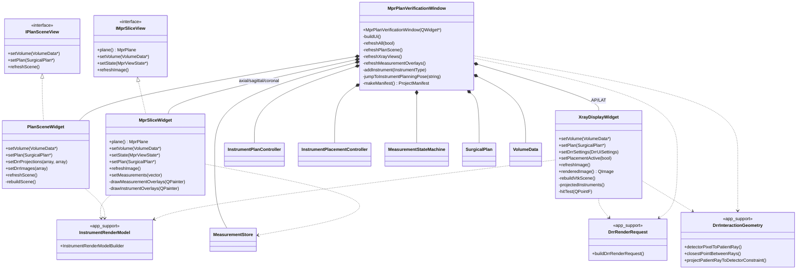

# 重构后架构说明 v0.1

## 目的

本文档记录当前重构后的应用层架构与主要类关系，作为后续拆分、清理和维护的参考。本文只描述既有代码结构，不引入新的业务行为要求。

## 当前分层

- `measurement_app`：Qt 桌面应用入口和界面协调层，负责用户交互、视图刷新、工作流编排。
- `measurement_app_support`：应用层可复用支持库，承载 DRR 交互几何、DRR 渲染请求构建、器械渲染模型等无 Qt Widget 状态的辅助逻辑。
- `measurement::*`：领域库，包括 core、planning、mpr、drr、dicom、persistence、vtk_adapter 等。
- 外部依赖：Qt、VTK、DCMTK，以及可选 CUDA。

## 架构图

```mermaid
flowchart TB
    subgraph App["measurement_app executable"]
        Main["main.cpp"]
        Window["MprPlanVerificationWindow<br/>主窗口协调器"]
        Ui["MprPlanVerificationWindowUi.cpp<br/>界面构建"]
        DrrFlow["MprPlanVerificationWindowDrr.cpp<br/>DRR 工作流"]
        MeasureFlow["MprPlanVerificationWindowMeasurements.cpp<br/>测量工作流"]

        Slice["MprSliceWidget<br/>MPR 切片视图"]
        SliceMeasure["MprSliceWidgetMeasurements.cpp<br/>切片测量绘制"]
        Scene["PlanSceneWidget<br/>3D/计划场景"]
        Xray["XrayDisplayWidget<br/>AP/LAT DRR 视图"]
    end

    subgraph AppSupport["measurement_app_support"]
        DrrReq["DrrRenderRequest"]
        DrrGeom["DrrInteractionGeometry"]
        RenderModel["InstrumentRenderModel"]
    end

    subgraph Domain["domain libraries"]
        Core["measurement::core"]
        Planning["measurement::planning"]
        Mpr["measurement::mpr"]
        Drr["measurement::drr"]
        Dicom["measurement::dicom"]
        Persist["measurement::persistence"]
        VtkAdapter["measurement::vtk_adapter"]
    end

    subgraph External["external"]
        Qt["Qt6 Widgets/OpenGL"]
        VTK["VTK"]
        DCMTK["DCMTK"]
        CUDA["CUDA optional"]
    end

    Main --> Window
    Window --> Ui
    Window --> DrrFlow
    Window --> MeasureFlow
    Window --> Slice
    Window --> Scene
    Window --> Xray

    Slice --> SliceMeasure
    Slice --> Mpr
    Slice --> VtkAdapter
    Slice --> RenderModel

    Scene --> RenderModel
    Scene --> VTK

    Xray --> DrrReq
    Xray --> DrrGeom
    Xray --> RenderModel
    Xray --> Drr
    Xray --> VTK

    DrrFlow --> DrrReq
    DrrFlow --> DrrGeom

    App --> AppSupport
    App --> Core
    App --> Planning
    App --> Mpr
    App --> Drr
    App --> Dicom
    App --> Persist
    App --> VtkAdapter

    App --> Qt
    Dicom --> DCMTK
    Drr --> CUDA
```



## 类图



## 主要职责边界

- `MprPlanVerificationWindow` 保留应用状态和流程协调职责，包括体数据、手术计划、测量状态、器械编辑状态和视图刷新入口。
- `MprPlanVerificationWindowUi.cpp` 负责界面控件创建、布局和信号连接。
- `MprPlanVerificationWindowMeasurements.cpp` 负责主窗口层面的测量工作流，包括测量列表、测量状态机交互、测量跳转和删除。
- `MprPlanVerificationWindowDrr.cpp` 负责主窗口层面的 DRR 工作流，包括 AP/LAT 视图刷新、双平面 DRR 放置、DRR 交互拖拽和约束计算。
- `MprSliceWidget.cpp` 负责 MPR 切片重采样显示、十字线、平面旋转、平移、缩放、窗宽窗位和器械截面叠加。
- `MprSliceWidgetMeasurements.cpp` 负责切片视图内的测量坐标转换、测量可见性绘制和测量预览绘制。
- `PlanSceneWidget` 负责 3D 场景和计划对象的 VTK 展示。
- `XrayDisplayWidget` 负责单个 DRR 视图的渲染、显示映射、放置线绘制、器械投影和鼠标交互。
- `measurement_app_support` 中的 `DrrRenderRequest`、`DrrInteractionGeometry`、`InstrumentRenderModel` 为多个 Widget/工作流共享，避免把几何和渲染模型逻辑重复写入 UI 类。

## 后续维护规则

- 新增主窗口工作流时，优先按职责放入独立 `MprPlanVerificationWindow*.cpp` 文件，避免继续扩大主窗口主实现文件。
- 新增视图内绘制逻辑时，优先判断是否属于独立 overlay 或交互层；如果职责清晰，应拆成单独实现文件。
- 可复用的几何、投影、渲染模型构建逻辑应进入 `measurement_app_support`，不要绑定到具体 Qt Widget。
- 重构只调整结构时，不应改变 public API、交互行为、默认参数或持久化格式。
- 每轮结构性改动后应运行 Debug build 和 CTest：

```powershell
cmake --build D:\code\codex-MPR_DRR\build --config Debug --parallel
ctest --test-dir D:\code\codex-MPR_DRR\build -C Debug --output-on-failure
```
