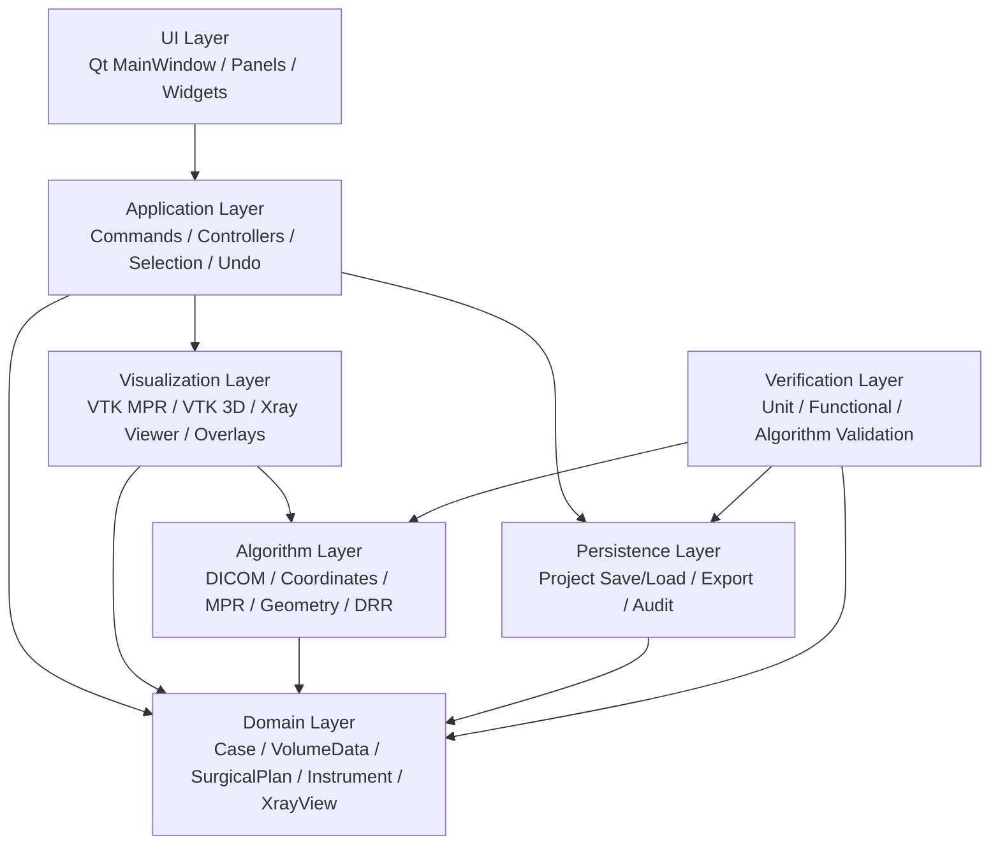
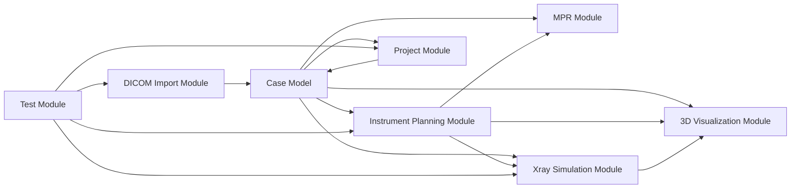
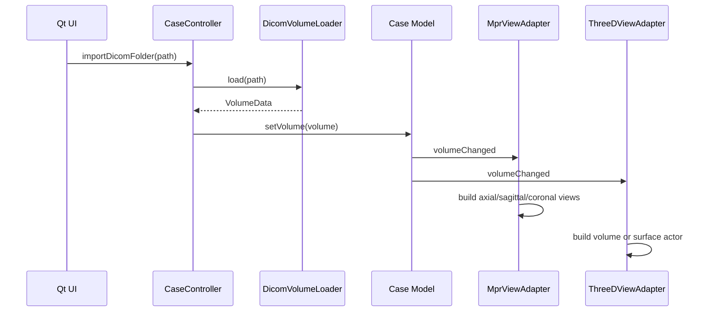
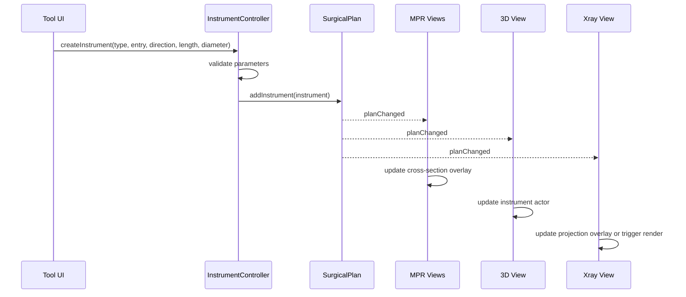
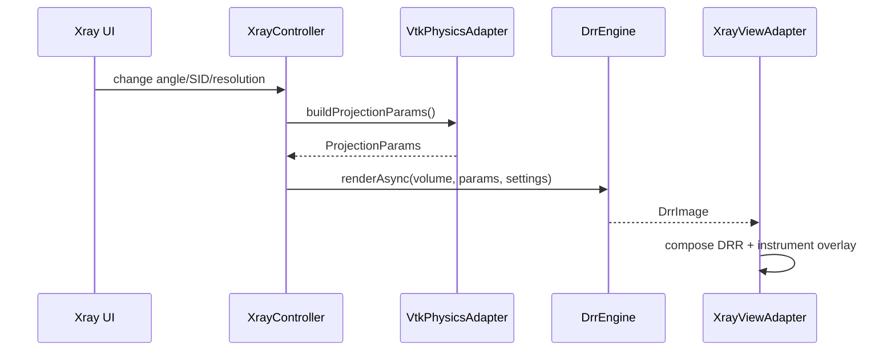
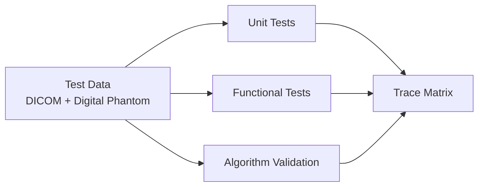

# 骨科手术规划仿真软件 SAD 概要设计 v0.1

文档状态：草案
版本：v0.1
日期：2026-05-03
关联需求：PRD v0.1
设计范围：Qt + VTK 桌面端椎弓根螺钉/导针规划与实时 X 射线仿真

## 1. 文档目的

本文档定义软件概要设计，用于说明系统级架构、模块边界、模块间交互、核心数据流、关键设计原则和技术约束。

本文档不展开单个函数、类成员和算法步骤。具体功能的搭建逻辑、关键类接口、处理流程和测试入口由《SAD 详细设计 v0.1》描述。

## 2. 设计目标

系统设计应满足以下目标：

- 支持单序列 CT DICOM 导入、MPR 显示、3D 显示、参数化导针/椎弓根螺钉规划、实时 DRR X 射线仿真。
- 支持审批级医疗软件开发所需的需求追踪、风险控制、单元测试、功能测试和算法验证。
- 保持业务模型与 Qt Widget、VTK Actor、GPU 资源解耦。
- 将医学空间数据统一管理在 DICOM Patient Coordinate，单位为毫米。
- 对关键算法提供可验证的 CPU 参考实现，并对实时路径提供 GPU 实现。
- 预留真实 X 光与模拟 X 光配准能力，但 v0.1 不实现配准。

## 3. 架构原则

### 3.1 单一事实来源

规划数据的单一事实来源是 Domain Layer 中的 `SurgicalPlan`、`Instrument`、`VolumeData` 和 `XrayView`。

MPR 视图、3D 视图、X 射线视图、属性面板都是这些 domain model 的呈现或编辑入口，不允许各自保存独立的规划副本。

### 3.2 坐标系统一

所有医学空间中的业务数据均以 DICOM Patient Coordinate 保存：

- CT volume 的物理位置。
- MPR 十字线位置。
- 器械入点、方向、长度、直径。
- X 射线源、探测器中心和探测器坐标轴。
- DRR 几何投影参数。

Qt screen coordinate 和 VTK world coordinate 只存在于交互层和渲染适配层。

### 3.3 UI 与算法解耦

核心算法不得依赖 Qt Widget：

- DICOM 导入可被测试程序直接调用。
- 坐标转换可被单元测试直接调用。
- 器械几何生成可被单元测试直接调用。
- CPU DRR 可被算法验证测试直接调用。
- GPU DRR 封装在接口后，接受同一套 `ProjectionParams`。

### 3.4 双通道 DRR

DRR 采用双实现：

- `CpuDrrEngine`：确定性参考实现，用于算法验证、单元测试和 GPU 对照。
- `GpuDrrEngine`：实时交互实现，用于 X 射线仿真视图。

两者使用相同输入模型：

- `VolumeData`
- `VolumeTransform`
- `ProjectionParams`
- `DrrRenderSettings`

### 3.5 可追溯设计

每个概要模块应关联 PRD 中的需求编号。详细设计和测试用例应继续继承这些编号。

## 4. 总体架构

系统采用分层架构：



### 4.1 UI Layer

职责：

- 提供主窗口、菜单、工具栏和 Dock 面板。
- 承载 MPR、3D 和 X 射线视图。
- 提供器械属性编辑、X 射线参数编辑和工程保存导出入口。
- 将用户操作转化为 Application Layer 的命令。

不负责：

- 不保存业务状态。
- 不直接改写 VTK actor 作为规划结果。
- 不执行 DICOM、DRR 或几何算法。

### 4.2 Application Layer

职责：

- 管理用户动作和业务命令。
- 维护当前病例、当前选择对象和当前工具模式。
- 协调 MPR、3D、X 射线和属性面板同步。
- 管理 undo/redo 事务边界。
- 调用 Persistence Layer 保存和加载工程。

典型控制器：

- `CaseController`
- `ViewSyncController`
- `InstrumentController`
- `XrayController`
- `ProjectController`
- `SelectionManager`
- `CommandStack`

### 4.3 Domain Layer

职责：

- 表达稳定业务模型。
- 保存规划数据和医学空间数据。
- 提供不依赖 UI 的状态变更接口。
- 为序列化、测试和算法提供一致输入。

核心对象：

- `Case`
- `VolumeData`
- `SurgicalPlan`
- `Instrument`
- `XrayView`
- `ViewState`
- `CoordinateFrame`

### 4.4 Visualization Layer

职责：

- 将 domain model 映射为 VTK 渲染对象。
- 处理 MPR、3D、DRR 图像和 overlay 显示。
- 将屏幕交互反算为患者坐标，再交给 Application Layer。
- 监听 domain 变更并刷新显示。

核心适配器：

- `MprViewAdapter`
- `ThreeDViewAdapter`
- `InstrumentActorFactory`
- `XrayViewAdapter`
- `VtkPhysicsAdapter`

MPR 核心实现采用 `vtkImageReslice + 外部控制器`。`vtkResliceCursor` 和 `vtkResliceCursorWidget` 不作为 v0.1 核心实现方案。

### 4.5 Algorithm Layer

职责：

- DICOM 读取与体数据构建。
- 坐标转换。
- MPR 重采样。
- 器械参数化几何生成。
- CPU/GPU DRR。
- 器械投影叠加。
- 数字 phantom 与算法验证辅助。

算法层以 plain C++ 数据结构和 VTK 数据对象为主，不依赖 Qt Widget。

### 4.6 Persistence Layer

职责：

- 保存和加载规划工程文件。
- 保存软件版本、schema 版本和 DICOM 引用。
- 导出模拟 X 光、MPR 和 3D 截图。
- 预留审计日志与报告导出能力。

### 4.7 Verification Layer

职责：

- 执行单元测试。
- 执行功能测试。
- 执行 DRR 算法验证。
- 维护需求-设计-测试追踪关系。

## 5. 模块关系

### 5.1 顶层模块图



### 5.2 DICOM Import Module

关联需求：

- FR-DICOM-001
- FR-DICOM-002
- FR-DICOM-003
- FR-DICOM-004

顶层职责：

- 从文件夹读取 CT DICOM。
- 校验单序列输入。
- 构建 `VolumeData`。
- 提供 HU、spacing、origin、direction、dimensions 和体素数据。

底层功能：

- DICOM 文件扫描。
- DICOM tag 提取。
- slice 排序。
- rescale slope/intercept 应用。
- `vtkImageData` 构建。
- `VolumeTransform` 构建。
- 错误诊断和导入报告。

### 5.3 MPR Module

关联需求：

- FR-MPR-001
- FR-MPR-002
- FR-MPR-003
- FR-MPR-004
- FR-MPR-005

顶层职责：

- 显示 Axial、Sagittal、Coronal 三正交 MPR。
- 同步十字线。
- 提供窗宽窗位、缩放、平移、滚轮切片。

底层功能：

- patient coordinate 到 slice plane 的转换。
- 基于 `vtkImageReslice` 的确定性切面重采样。
- 外部 `MprViewState` 和 `ViewSyncController` 控制十字线、切面位置和视图同步。
- MPR overlay 绘制。
- 屏幕点到患者坐标反算。
- 器械截面 overlay。

### 5.4 3D Visualization Module

关联需求：

- FR-3D-001
- FR-3D-002
- FR-3D-003
- FR-3D-004

顶层职责：

- 显示 CT 的 3D 体渲染或骨表面。
- 显示器械几何。
- 显示 MPR 切面和 X 射线相机辅助对象。

底层功能：

- VTK volume rendering 或 marching cubes。
- domain instrument 到 vtkActor 映射。
- object visibility 管理。
- 相机和交互状态管理。

### 5.5 Instrument Planning Module

关联需求：

- FR-INS-001
- FR-INS-002
- FR-INS-003
- FR-INS-004
- FR-INS-005
- FR-INS-006
- FR-INS-007

顶层职责：

- 创建、编辑、选择、隐藏、锁定和删除导针/椎弓根螺钉。
- 保证器械参数以患者坐标保存。
- 通知 MPR、3D 和 Xray 视图同步刷新。

底层功能：

- 参数约束。
- entry point 与 direction 归一化。
- length/diameter 校验。
- 圆柱/简化螺钉几何生成。
- MPR 截面轮廓生成。
- DRR 投影几何生成。

### 5.6 Xray Simulation Module

关联需求：

- FR-XRAY-001
- FR-XRAY-002
- FR-XRAY-003
- FR-XRAY-004
- FR-XRAY-005
- FR-XRAY-006
- FR-XRAY-007

顶层职责：

- 基于 CT 体数据和 X 射线几何生成 DRR。
- 支持 AP、LAT 和自定义角度。
- 将器械投影叠加到模拟 X 光片。
- 支持实时预览与确定性参考验证。

底层功能：

- `ProjectionParams` 构建。
- `VolumeTransform` 上传和维护。
- CPU ray casting。
- GPU ray casting。
- 后处理窗宽窗位。
- 器械解析几何投影。
- CPU/GPU 误差对比。

### 5.7 Project Module

关联需求：

- FR-PROJ-001
- FR-PROJ-002
- FR-PROJ-003
- FR-PROJ-004
- FR-PROJ-005

顶层职责：

- 保存和加载规划工程。
- 导出图像和截图。
- 保存 schema 版本和软件版本。

底层功能：

- 单文件工程包。
- 工程包 manifest JSON schema。
- DICOM 引用路径和摘要。
- instrument 参数序列化。
- Xray 参数序列化。
- view state 序列化。

## 6. 核心数据流

### 6.1 DICOM 导入到显示



### 6.2 器械创建与同步



### 6.3 X 射线实时仿真



## 7. 坐标与变换概要

### 7.1 坐标层次

系统采用四类主要坐标：

| 坐标 | 用途 | 所属层 |
| --- | --- | --- |
| Voxel Index Space | 体素索引、GPU 纹理采样 | Algorithm |
| DICOM Patient Coordinate | 医学空间、业务数据、物理仿真 | Domain / Algorithm |
| VTK World Space | 3D 渲染、相机、actor | Visualization |
| Qt Screen Coordinate | 鼠标交互、窗口像素 | UI |

业务对象只保存 DICOM Patient Coordinate。

### 7.2 变换原则

从 DICOM metadata 构建固定矩阵：

```text
M_dicom: voxel index -> patient coordinate
M_dicom_inv: patient coordinate -> voxel index
```

VTK 中允许存在渲染 actor 变换：

```text
M_actor: physics/patient coordinate -> VTK world coordinate
M_actor_inv: VTK world coordinate -> physics/patient coordinate
```

v0.1 允许系统通过设置矩阵对 CT actor 进行非交互式移动。用户不直接拖拽 CT actor，但配准、测试或重定位流程可更新 `M_actor`。`VtkPhysicsAdapter` 必须始终读取当前 actor matrix，并将 VTK camera 转换回 patient/physics coordinate。

DRR engine 接收的所有 X 射线参数必须已经转换到 physics/patient coordinate。

### 7.3 VtkPhysicsAdapter 角色

`VtkPhysicsAdapter` 是 VTK 场景与物理仿真之间的边界对象。

职责：

- 从 vtkCamera 和 vtkVolume actor 读取当前渲染状态。
- 将相机位置、焦点和 viewUp 转换到 patient coordinate。
- 构建 `ProjectionParams`。
- 将 UI 中修改的 X 射线参数反写到 VTK camera。
- 阻止双向同步中的事件循环。

## 8. 关键接口概要

### 8.1 Domain 核心模型

```cpp
struct VolumeData;
struct Instrument;
struct SurgicalPlan;
struct XrayView;
struct Case;
```

### 8.2 Algorithm 核心服务

```cpp
class DicomVolumeLoader;
class CoordinateTransformer;
class MprResliceEngine;
class InstrumentGeometryBuilder;
class CpuDrrEngine;
class GpuDrrEngine;
class InstrumentProjector;
```

### 8.3 Visualization 核心适配器

```cpp
class MprViewAdapter;
class ThreeDViewAdapter;
class XrayViewAdapter;
class InstrumentActorFactory;
class VtkPhysicsAdapter;
```

### 8.4 Application 核心控制器

```cpp
class CaseController;
class ViewSyncController;
class InstrumentController;
class XrayController;
class ProjectController;
class SelectionManager;
class CommandStack;
```

## 9. 线程与异步设计

### 9.1 主线程

Qt 主线程负责：

- UI 事件处理。
- VTK widget 渲染触发。
- domain model 的受控修改。
- 轻量级视图同步。

### 9.2 后台线程

后台线程负责：

- DICOM 文件夹扫描和读取。
- CPU DRR 渲染。
- 高质量图像导出。
- 工程文件保存加载。

### 9.3 GPU 异步

GPU DRR 使用异步渲染接口：

- 新参数到达时可取消或丢弃旧帧。
- 只显示最新完成且参数版本匹配的图像。
- UI 修改频繁时采用 debounce 或帧率限制。

## 10. 错误处理概要

错误分为：

- 用户输入错误：非法文件夹、非法参数。
- 数据错误：DICOM tag 缺失、slice 不连续、非 CT 数据。
- 算法错误：坐标矩阵不可逆、DRR 参数非法。
- 资源错误：GPU 内存不足、图像导出失败。
- 内部错误：状态不一致、schema 版本不兼容。

所有错误应包含：

- 错误码。
- 用户可读消息。
- 技术诊断信息。
- 是否可恢复。

## 11. 测试架构概要



测试层级：

- 单元测试：坐标、DICOM、器械几何、CPU DRR、工程序列化。
- 功能测试：导入、三视图、器械编辑、DRR 生成、保存加载。
- 算法验证：phantom 解析结果、CPU/GPU 一致性、投影误差。

## 12. 外部依赖概要

已确认依赖：

- Qt：桌面 UI、信号槽、线程、文件对话框。
- VTK：MPR、3D 渲染、图像数据结构、相机和 actor。
- DCMTK：DICOM 解析、tag 读取、像素数据装载和 DICOM 合规处理。
- CUDA：实时 DRR 的 GPU 计算路径。
- CMake/CTest：构建与测试。

第三方依赖应进入 SOUP 清单，并记录版本、用途、风险和验证方式。

## 13. 已确认技术决策

| ID | 决策 | 概要影响 |
| --- | --- | --- |
| SAD-DEC-001 | DICOM 库选择 DCMTK。 | DICOM Import Module 基于 DCMTK 设计，VTK 只接收构建后的 `vtkImageData`。 |
| SAD-DEC-002 | GPU DRR 选择 CUDA。 | `CudaDrrEngine` 以 CUDA kernel、3D texture 和异步 stream 为主线设计。 |
| SAD-DEC-003 | 允许 CT actor 非交互式矩阵移动。 | `VtkPhysicsAdapter` 必须处理 `M_actor` 和 `M_actor_inv`，DRR 参数始终转换到 patient/physics。 |
| SAD-DEC-004 | 工程保存为单文件工程包。 | Persistence Layer 输出包文件，包内以 manifest JSON 表达规划和引用。 |
| SAD-DEC-005 | DRR 图像像素默认不加水印。 | 仿真标识放在 UI、文件名、manifest 或图像元数据中。 |
| SAD-DEC-006 | MPR 核心采用 `vtkImageReslice + 外部控制`。 | MPR 状态由 domain/application 控制，便于单元测试和多视图同步验证。 |

## 14. 需求追踪概要

| 模块 | 主要需求 |
| --- | --- |
| DICOM Import | FR-DICOM-001 到 FR-DICOM-004 |
| MPR | FR-MPR-001 到 FR-MPR-005 |
| 3D Visualization | FR-3D-001 到 FR-3D-004 |
| Instrument Planning | FR-INS-001 到 FR-INS-007 |
| Xray Simulation | FR-XRAY-001 到 FR-XRAY-007 |
| Project | FR-PROJ-001 到 FR-PROJ-005 |
| Verification | NFR-TEST-001 到 NFR-TEST-003 |
| Traceability | NFR-TRACE-001 到 NFR-TRACE-003 |

## 15. 设计风险

| ID | 风险 | 设计控制 |
| --- | --- | --- |
| SAD-RISK-001 | 坐标体系混乱导致器械或 DRR 错位 | Domain 统一 patient coordinate，Visualization 只做适配 |
| SAD-RISK-002 | VTK actor 状态污染业务数据 | 禁止 actor 作为业务状态来源，使用 adapter 单向映射 |
| SAD-RISK-003 | GPU DRR 输出难以验证 | 保留 CPU reference，并建立 phantom 对照 |
| SAD-RISK-004 | 实时渲染阻塞 UI | DRR 异步渲染，旧帧丢弃，UI 主线程不做重计算 |
| SAD-RISK-005 | 工程文件未来不兼容 | schema version 和迁移策略 |
| SAD-RISK-006 | `vtkResliceCursorWidget` 内部状态与 domain 状态分叉 | v0.1 不采用 cursor widget 作为核心方案，MPR 由外部状态驱动 |

## 16. 版本记录

| 版本 | 日期 | 说明 |
| --- | --- | --- |
| v0.1 | 2026-05-03 | 建立系统概要设计、模块边界、交互关系、数据流和坐标设计基线。 |
